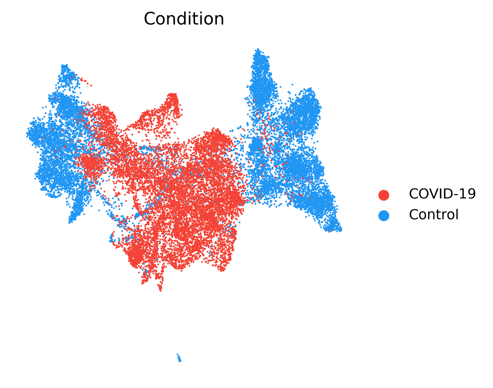
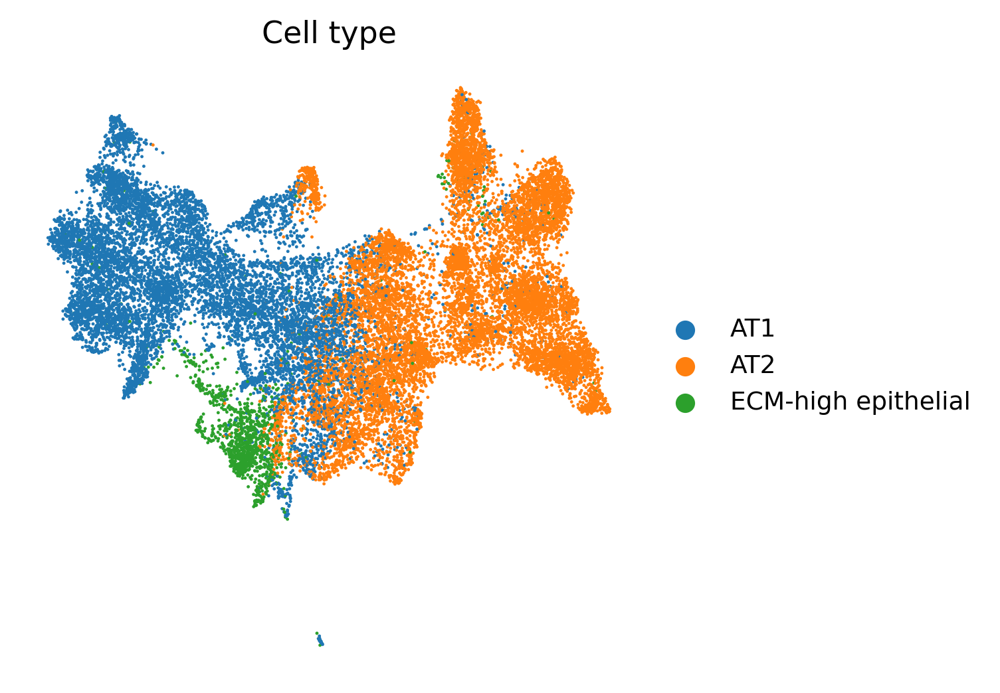
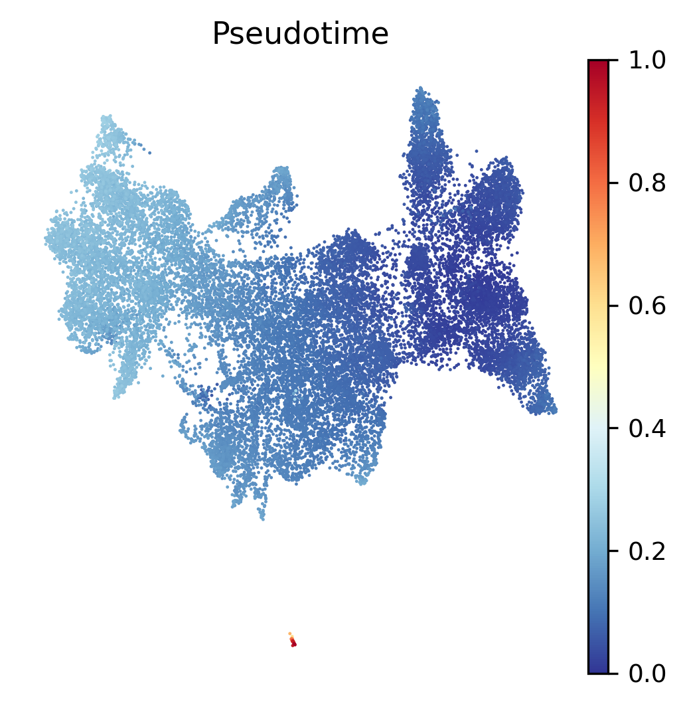
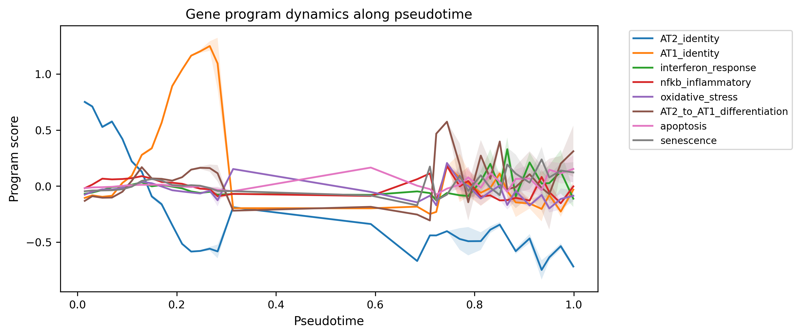
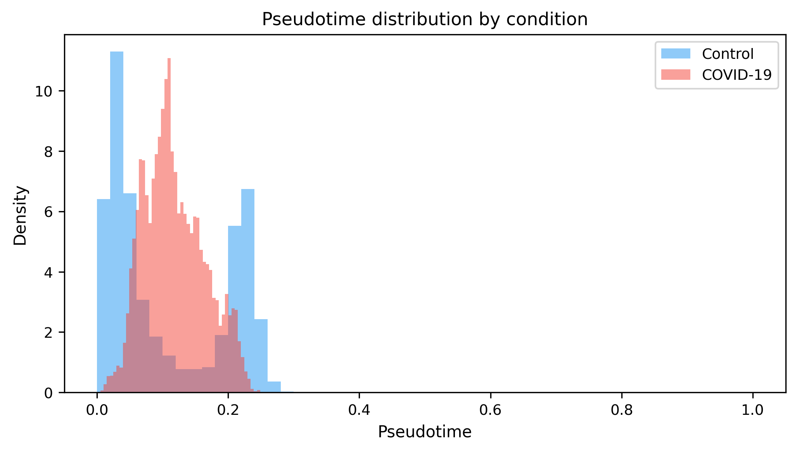
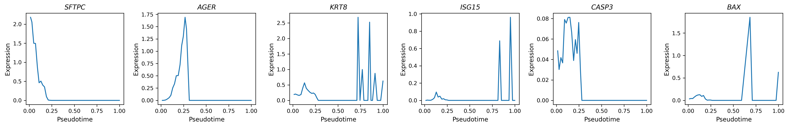
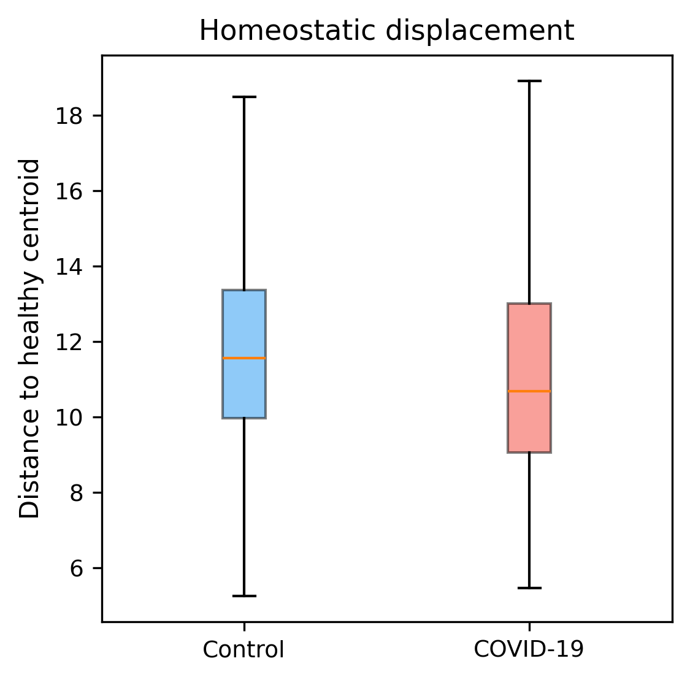
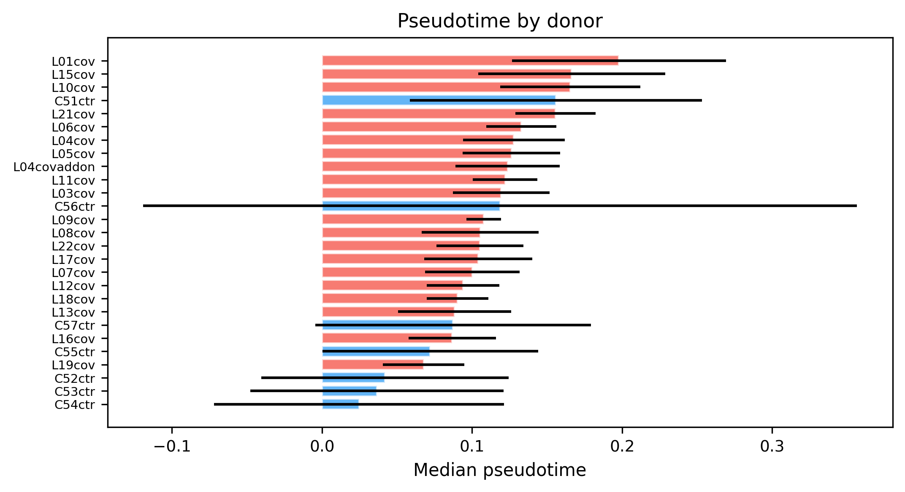

#+TITLE: Ablation-First Trajectory Analysis of Alveolar Epithelial Robustness Collapse in Lethal COVID-19
#+AUTHOR: Class Project --- revised manuscript (v2)
#+STARTUP: overview
#+OPTIONS: toc:2

A class-project reanalysis of the Columbia/NYP COVID-19 Lung Atlas (SCP1219,
Melms 2021) with pre-registered robustness tests, a ten-way ablation battery,
and an independent cross-cohort replication on 618 donors from cellxgene census.

*Status*: v2 revision complete. Harmony batch correction fixed, gene-program
audit done, independent replication added.

* TL;DR (v2)

| Criterion                   | Primary (SCP1219)      | Replication (census, 618 donors) |
|-----------------------------+------------------------+----------------------------------|
| Centroid displacement (MW)  | fails (p=1.0)          | fails cell-level (p=1.0)         |
| Dispersion (Levene)         | supported (p ≈ 0)      | *supported* (p ≈ 10^{-137})      |
| Pseudotime enrichment       | supported (p=0.001)    | supported donor-level (p=1.98e-3)|
| Harmony-corrected shift     | ---                    | *MPD × 2.6* (0.0483 → 0.1246)    |
| KRT8^+/CLDN4^+ DATPs        | 3.1× enriched          | 0.48× (retracted as portable)    |

*Takeaways.* Robustness collapse (dispersion + donor-level pseudotime
displacement) replicates across cohorts. Directional centroid displacement and
marker-threshold DATP enrichment do not.

* Manuscripts and presentations

** v1 (original)
- [[file:manuscript/paper.tex][paper.tex]] --- [[file:manuscript/paper.pdf][paper.pdf]]
- [[file:manuscript/presentation.tex][presentation.tex]] --- [[file:manuscript/presentation.pdf][presentation.pdf]]
- [[file:manuscript/explainer.tex][explainer.tex]] --- [[file:manuscript/explainer.pdf][explainer.pdf]]

** v2 (revised, with Harmony fix + replication)
- [[file:manuscript/paper_v2.tex][paper_v2.tex]] --- [[file:manuscript/paper_v2.pdf][paper_v2.pdf]]
- [[file:manuscript/presentation_2.tex][presentation_2.tex]] --- [[file:manuscript/presentation_2.pdf][presentation_2.pdf]]
- [[file:manuscript/explainer_2.tex][explainer_2.tex]] --- [[file:manuscript/explainer_2.pdf][explainer_2.pdf]]

** Planning documents
- [[file:project_proposal.md][project_proposal.md]]
- [[file:project_plan.md][project_plan.md]] --- [[file:project_plan_summary.md][project_plan_summary.md]]
- [[file:ANALYSIS_PLAN.md][ANALYSIS_PLAN.md]]
- [[file:MANUSCRIPT_OUTLINE.md][MANUSCRIPT_OUTLINE.md]]
- [[file:FIGURE_PLAN.md][FIGURE_PLAN.md]] --- [[file:TABLE_PLAN.md][TABLE_PLAN.md]]
- [[file:PROJECT_STATUS.md][PROJECT_STATUS.md]] --- [[file:RUNBOOK.md][RUNBOOK.md]] --- [[file:TODO.md][TODO.md]]

* Figures

| #  | File                                                                                            | What it shows                                |
|----+-------------------------------------------------------------------------------------------------+----------------------------------------------|
| 1a | [[file:results/figures/fig1a_condition.pdf][pdf]] /                        | UMAP colored by condition                     |
| 1b | [[file:results/figures/fig1b_celltype.pdf][pdf]] /                          | UMAP colored by cell type                     |
| 2  | [[file:results/figures/fig2_pseudotime.pdf][pdf]] /                          | UMAP colored by diffusion pseudotime          |
| 3  | [[file:results/figures/fig3_program_dynamics.pdf][pdf]] /            | 8 gene-program scores vs pseudotime           |
| 4  | [[file:results/figures/fig4_pseudotime_density.pdf][pdf]] /          | Pseudotime density, COVID vs Healthy          |
| 5  | [[file:results/figures/fig5_marker_trends.pdf][pdf]] /                      | Canonical marker expression along pseudotime  |
| 5b | [[file:results/figures/fig5b_displacement.pdf][pdf]] /                    | Within-group distance to centroid (dispersion)|
| 7  | [[file:results/figures/fig7_donor_consistency.pdf][pdf]] /              | LOO donor consistency of pseudotime shift     |

* Tables

** Main
- [[file:results/tables/table2_robustness_metrics.csv][table2_robustness_metrics.csv]] --- 3 pre-registered criteria outcomes
- [[file:results/tables/table3_composite_evidence.csv][table3_composite_evidence.csv]] --- composite assessment
- [[file:results/tables/pseudotime_by_condition.csv][pseudotime_by_condition.csv]]

** Supplementary
- [[file:results/tables/tableS2_qc_prefilter.csv][tableS2_qc_prefilter.csv]] / [[file:results/tables/tableS2_qc_postfilter.csv][tableS2_qc_postfilter.csv]] --- QC metrics
- [[file:results/tables/tableS3_marker_validation.csv][tableS3_marker_validation.csv]] --- marker specificity
- [[file:results/tables/tableS5_donor_statistics.csv][tableS5_donor_statistics.csv]] --- per-donor cell counts and LOO
- [[file:results/ablations/tableS6_ablation_summary.csv][tableS6_ablation_summary.csv]] --- full ablation battery
- [[file:results/tables/tableS8_program_trends.csv][tableS8_program_trends.csv]] --- program ordering along pseudotime

* Ablations

| #  | Variant                                                                                                       | Role                           |
|----+---------------------------------------------------------------------------------------------------------------+--------------------------------|
| 01 | [[file:results/ablations/01_at2_only/][AT2-only]]                                                                                                    | restrict to AT2                |
| 02 | [[file:results/ablations/02_embedding_diffmap/][diffmap]] / [[file:results/ablations/02_embedding_umap/][umap]]                                                | embedding swap                 |
| 03 | [[file:results/ablations/03_batch_corrected/][corrected]] / [[file:results/ablations/03_batch_uncorrected/][uncorrected]]                                                | Harmony on/off (*v2: fixed*)   |
| 04 | [[file:results/ablations/04_no_apoptosis_genes/][no-apoptosis-genes]]                                                                                        | program leakage                |
| 05 | [[file:results/ablations/05_root_healthy_AT2_centroid/][AT2-centroid]] / [[file:results/ablations/05_root_healthy_AT1_centroid/][AT1-centroid]] / [[file:results/ablations/05_root_random_healthy/][random-healthy]] / [[file:results/ablations/05_root_covid_extreme/][COVID-extreme]] | root sensitivity   |
| 06 | [[file:results/ablations/06_broader_epithelial/][broader-epithelial]]                                                                                      | airway inclusion               |
| 07 | [[file:results/ablations/07_leave_one_donor_out/][LOO]]                                                                                                            | 27-iter LOO                    |
| 08 | [[file:results/ablations/08_alt_programs_curated_only/][curated-only]] / [[file:results/ablations/08_alt_programs_msigdb_only/][MSigDB-only]]                                                                | gene-list sensitivity          |
| 09 | [[file:results/ablations/09_palantir/][Palantir]]                                                                                                        | alt trajectory algorithm       |
| 10 | [[file:results/ablations/10_permutation_controls/][permutation-controls]]                                                                                      | 1000 label shuffles            |

Summary: [[file:results/ablations/tableS6_ablation_summary.csv][tableS6_ablation_summary.csv]]

* Replication cohort (v2)

- Scripts: [[file:scripts/replication/fetch_replication.py][fetch_replication.py]], [[file:scripts/replication/analyze_replication.py][analyze_replication.py]]
- Data (not tracked): =data/replication/replication_alveolar.h5ad= (921,510 × 84)
- Results: [[file:results/replication/replication_metrics.json][replication_metrics.json]], [[file:results/replication/replication_obs.parquet][replication_obs.parquet]]

Headline: n=89,736 cells post-cap (4,441 COVID / 85,295 normal; 43 COVID donors
/ 575 normal donors). Dispersion Levene stat 626, p≈10^{-137}; donor-level MW
p=1.98e-3.

* Source code

- [[file:src/io.py][io.py]] --- data loading
- [[file:src/qc.py][qc.py]] --- QC filters
- [[file:src/embedding.py][embedding.py]] --- PCA/UMAP/diffmap/Harmony (*v2: Harmony orientation fix, lines 196-199*)
- [[file:src/trajectory.py][trajectory.py]] --- diffusion pseudotime
- [[file:src/programs.py][programs.py]] --- gene-program scoring
- [[file:src/annotation.py][annotation.py]] --- cell-type annotation
- [[file:src/stats.py][stats.py]] --- pre-registered tests
- [[file:src/plots.py][plots.py]] --- figure code
- [[file:src/utils.py][utils.py]]

Drivers:
- [[file:scripts/run_pipeline.py][scripts/run_pipeline.py]]
- [[file:scripts/ablations/run_all_ablations.py][scripts/ablations/run_all_ablations.py]]
- [[file:scripts/download_data.py][scripts/download_data.py]]
- [[file:Snakefile][Snakefile]] / [[file:Makefile][Makefile]]

Config: [[file:config.yaml][config.yaml]], [[file:requirements.txt][requirements.txt]]

* How to reproduce

#+begin_src bash
# primary pipeline
python scripts/run_pipeline.py

# ablations (10-way)
python scripts/ablations/run_all_ablations.py

# v2 replication
python scripts/replication/fetch_replication.py
python scripts/replication/analyze_replication.py

# build papers
cd manuscript
pdflatex paper_v2.tex && pdflatex paper_v2.tex
pdflatex presentation_2.tex
pdflatex explainer_2.tex && pdflatex explainer_2.tex
#+end_src

Environment: Python 3.12.3, scanpy 1.12.1, anndata 0.12.10, harmonypy 0.2.0
(PyTorch backend), palantir 1.4.4. Seed 42 throughout.
